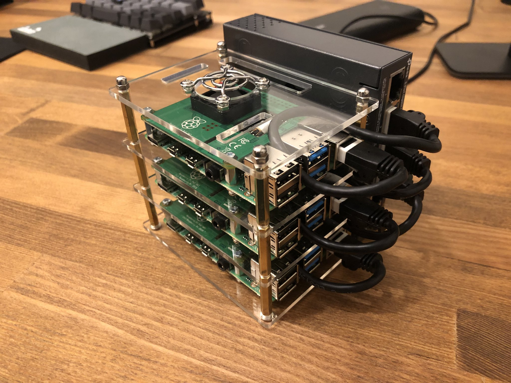

# おうち Kubernetes

学生向けに実施したKubernetesを勉強するためのインターンシップで利用した資料を、その他の学生・社会人の方も試せるように公開しました。

Blog: https://developers.cyberagent.co.jp/blog/archives/27443/

* [物理構築手順](./how-to-create-cluster-physical)
* [The Hardway 論理構築手順](./how-to-create-cluster-logical-hardway)
* [kubeadm 論理構築手順](./how-to-create-cluster-logical-kubeadm)

